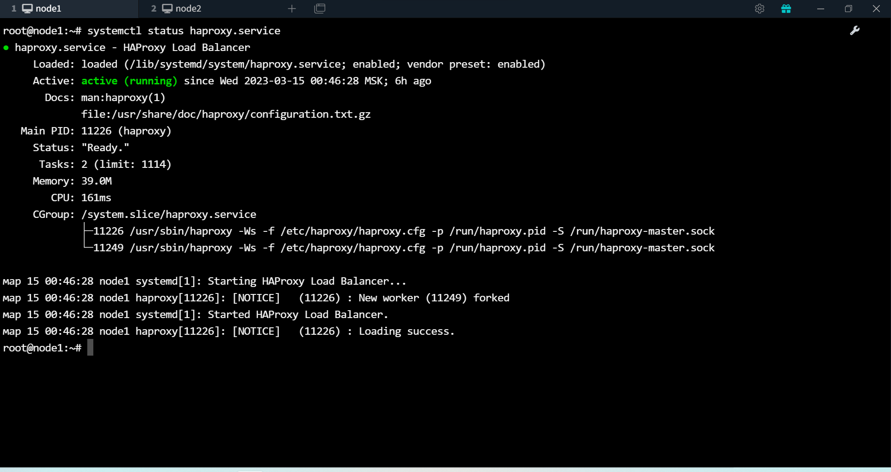
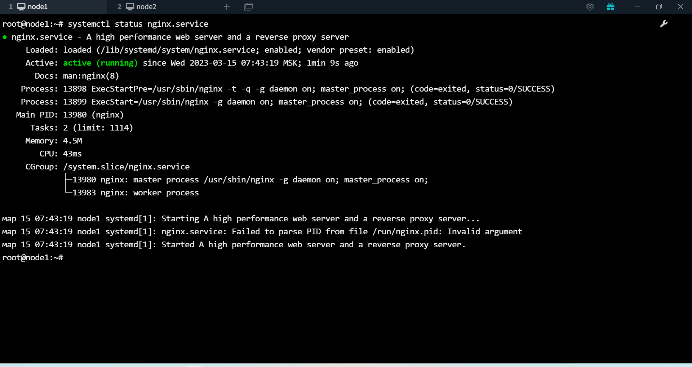
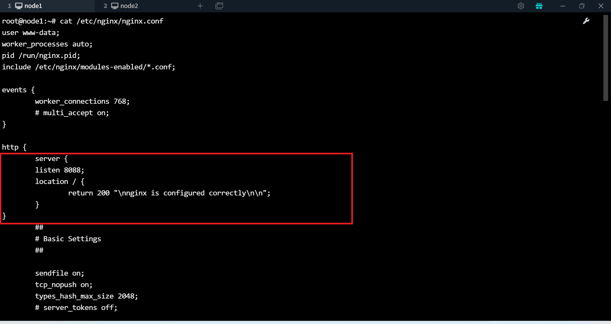

# Домашнее задание к занятию 10.5 «Балансировка нагрузки. HAProxy/Nginx» -Алексей Фокин
---
### Задание 1

Что такое балансировка нагрузки и зачем она нужна? 

*Приведите ответ в свободной форме.*

Балансировка нагрузки (load balancing) — это процесс распределения нагрузки на пул серверов. Балансировка нагрузки дает 
сокращение времени простоя,масштабируемость, отказоустойчивость.
Балансировщик нагрузки — это 
сервис, который занимается распределением нагрузки между пулом приложений, которые 
находятся за ним, стараясь максимизировать скорость и утилизировать ресурсы приложений. Также, гарантирует, что приложения не будут перегружены.

---

### Задание 2

Чем отличаются алгоритмы балансировки Round Robin и Weighted Round Robin? В каких случаях каждый из них лучше применять? 

*Приведите ответ в свободной форме.*

**Round Robin**

Запросы распределяются по пулу 
сервером последовательно.
Если в пуле все сервера 
одинаковой мощности, то этот 
алгоритм скорее всего подойдет 
идеально. 

**Weighted Round Robin**

Тот же round robin, но имеет 
дополнительное свойство — вес 
сервера. С его помощью мы можем 
указать балансировщику, сколько 
трафика отправлять на тот или иной 
сервер. Так сервера помощнее 
будут иметь больший вес 
и, соответственно, обрабатывать 
больше запросов, чем другие 
сервера.

---

### Задание 3

Установите и запустите Haproxy.

*Приведите скриншот systemctl status haproxy, где будет видно, что Haproxy запущен.*

---

### Задание 4

Установите и запустите Nginx.

*Приведите скриншот systemctl status nginx, где будет видно, что Nginx запущен.*

---

### Задание 5

Настройте Nginx на виртуальной машине таким образом, чтобы при запросе:

`curl http://localhost:8088/ping`

он возвращал в ответе строчку: 

"nginx is configured correctly".

*Приведите конфигурации настроенного Nginx сервиса и скриншот результата выполнения команды curl http://localhost:8088/ping.*

---

## Задания со звёздочкой*

Эти задания дополнительные. Их выполнять не обязательно. На зачёт это не повлияет. Вы можете их выполнить, если хотите глубже разобраться в материале.

---

### Задание 6*

Настройте Haproxy таким образом, чтобы при ответе на запрос:

`curl http://localhost:8080/`

он проксировал его в Nginx на порту 8088, который был настроен в задании 5 и возвращал от него ответ: 

"nginx is configured correctly". 

*Приведите конфигурации настроенного Haproxy и скриншоты результата выполнения команды curl http://localhost:8080/.*
