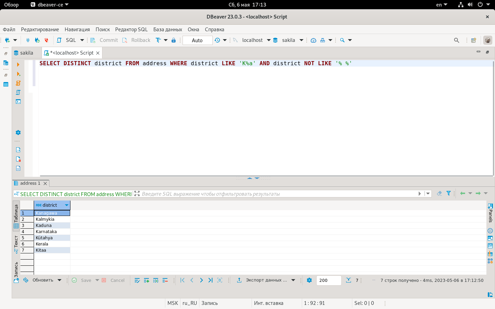
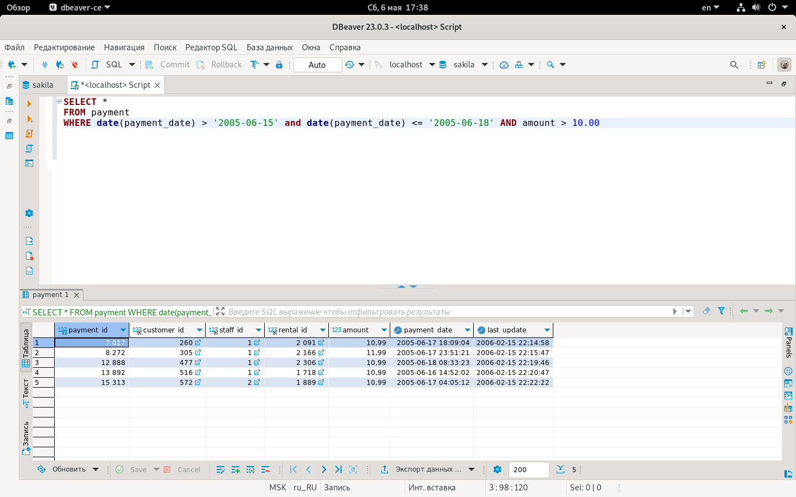
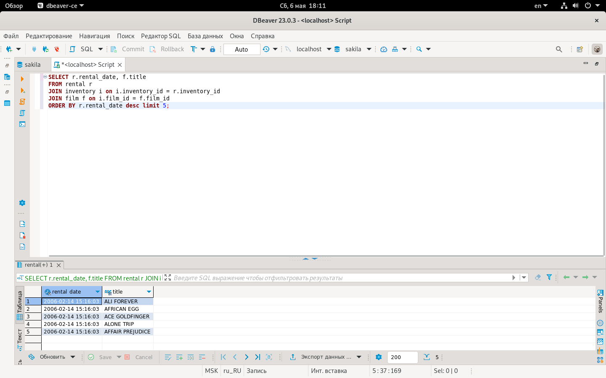
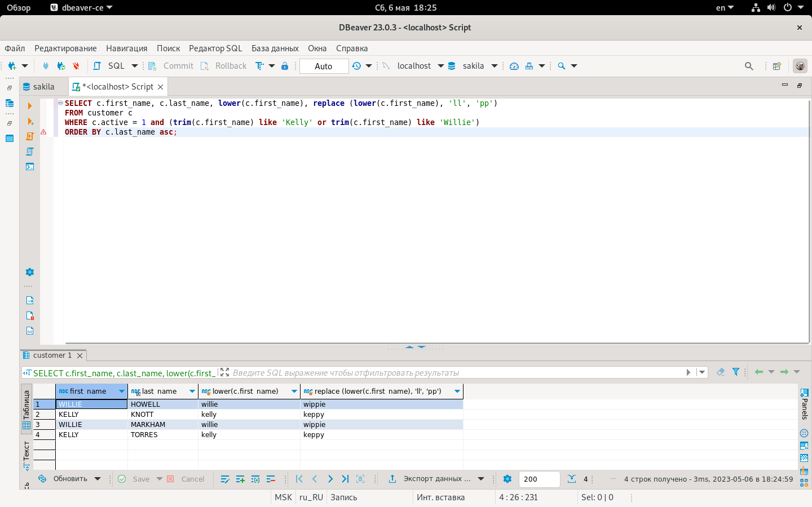

# Домашнее задание к занятию «SQL. Часть 1» - Алексей Фокин

---

Задание можно выполнить как в любом IDE, так и в командной строке.

### Задание 1

Получите уникальные названия районов из таблицы с адресами, которые начинаются на “K” и заканчиваются на “a” и не содержат пробелов.
```
SELECT DISTINCT district FROM address WHERE district LIKE 'K%a' AND district NOT LIKE '% %'
```


### Задание 2

Получите из таблицы платежей за прокат фильмов информацию по платежам, которые выполнялись в промежуток с 15 июня 2005 года по 18 июня 2005 года **включительно** и стоимость которых превышает 10.00.
```
SELECT * 
FROM payment
WHERE date(payment_date) > '2005-06-15' and date(payment_date) <= '2005-06-18' AND amount > 10.00
```


### Задание 3

Получите последние пять аренд фильмов.
```
SELECT r.rental_date, f.title
FROM rental r
JOIN inventory i on i.inventory_id = r.inventory_id
JOIN film f on i.film_id = f.film_id
ORDER BY r.rental_date desc limit 5;
```


### Задание 4

Одним запросом получите активных покупателей, имена которых Kelly или Willie. 

Сформируйте вывод в результат таким образом:
- все буквы в фамилии и имени из верхнего регистра переведите в нижний регистр,
- замените буквы 'll' в именах на 'pp'.
```
SELECT c.first_name, c.last_name, lower(c.first_name), replace (lower(c.first_name), 'll', 'pp')
FROM customer c
WHERE c.active = 1 and (trim(c.first_name) like 'Kelly' or trim(c.first_name) like 'Willie')
ORDER BY c.last_name asc;
```



## Дополнительные задания (со звёздочкой*)
Эти задания дополнительные, то есть не обязательные к выполнению, и никак не повлияют на получение вами зачёта по этому домашнему заданию. Вы можете их выполнить, если хотите глубже шире разобраться в материале.

### Задание 5*

Выведите Email каждого покупателя, разделив значение Email на две отдельных колонки: в первой колонке должно быть значение, указанное до @, во второй — значение, указанное после @.

### Задание 6*

Доработайте запрос из предыдущего задания, скорректируйте значения в новых колонках: первая буква должна быть заглавной, остальные — строчными.
