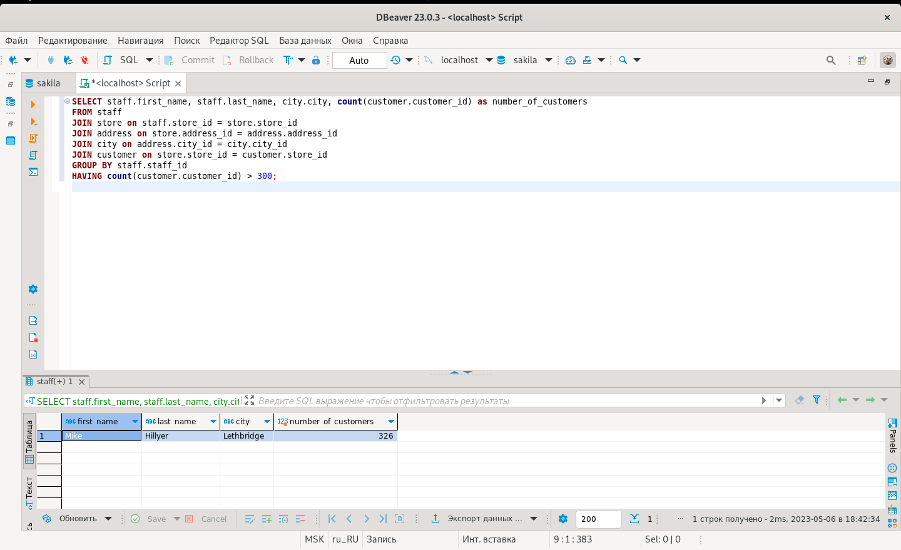
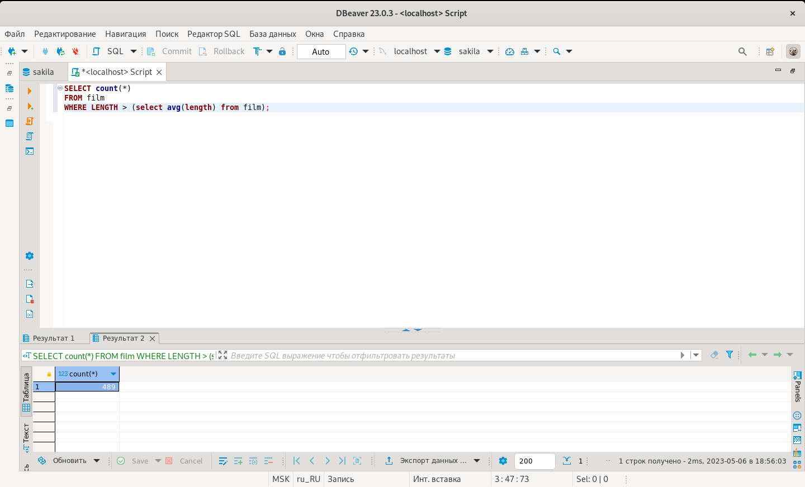
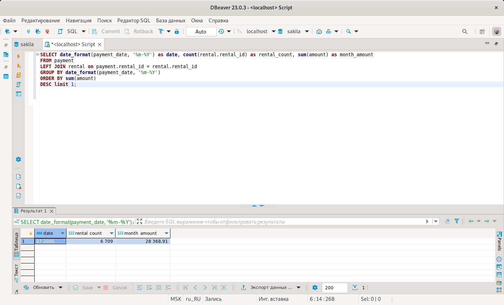

# Домашнее задание к занятию «SQL. Часть 2» - Алексей Фокин

---

Задание можно выполнить как в любом IDE, так и в командной строке.

### Задание 1

Одним запросом получите информацию о магазине, в котором обслуживается более 300 покупателей, и выведите в результат следующую информацию: 
- фамилия и имя сотрудника из этого магазина;
- город нахождения магазина;
- количество пользователей, закреплённых в этом магазине.
```
SELECT staff.first_name, staff.last_name, city.city, count(customer.customer_id) as number_of_customers
FROM staff 
JOIN store on staff.store_id = store.store_id 
JOIN address on store.address_id = address.address_id 
JOIN city on address.city_id = city.city_id 
JOIN customer on store.store_id = customer.store_id 
GROUP BY staff.staff_id 
HAVING count(customer.customer_id) > 300;
```


### Задание 2

Получите количество фильмов, продолжительность которых больше средней продолжительности всех фильмов.
```
SELECT count(*) 
FROM film
WHERE LENGTH > (select avg(length) from film);
```


### Задание 3

Получите информацию, за какой месяц была получена наибольшая сумма платежей, и добавьте информацию по количеству аренд за этот месяц.
```
SELECT date_format(payment_date, '%m-%Y') as date, count(rental.rental_id) as rental_count, sum(amount) as month_amount
FROM payment
LEFT JOIN rental on payment.rental_id = rental.rental_id
GROUP BY date_format(payment_date, '%m-%Y')
ORDER BY sum(amount)
DESC limit 1;
```



## Дополнительные задания (со звёздочкой*)
Эти задания дополнительные, то есть не обязательные к выполнению, и никак не повлияют на получение вами зачёта по этому домашнему заданию. Вы можете их выполнить, если хотите глубже шире разобраться в материале.

### Задание 4*

Посчитайте количество продаж, выполненных каждым продавцом. Добавьте вычисляемую колонку «Премия». Если количество продаж превышает 8000, то значение в колонке будет «Да», иначе должно быть значение «Нет».

### Задание 5*

Найдите фильмы, которые ни разу не брали в аренду.
