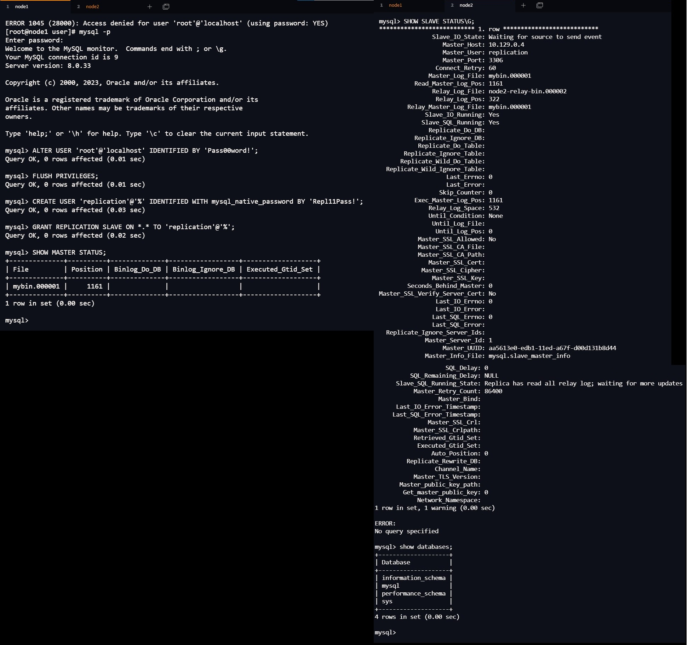
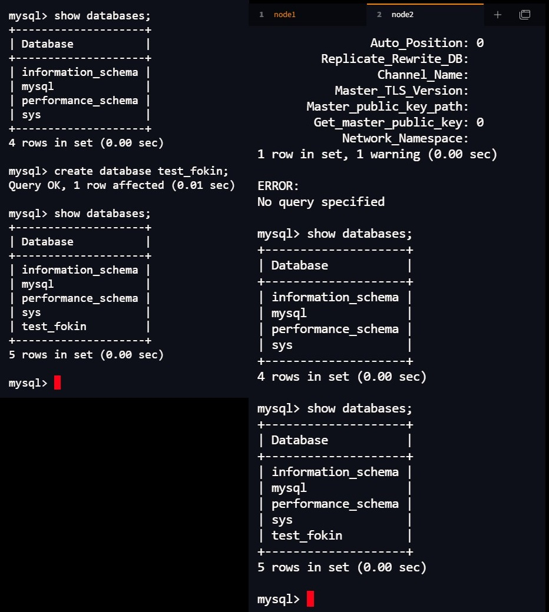
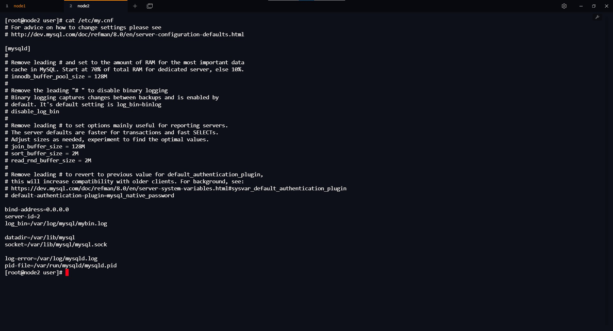
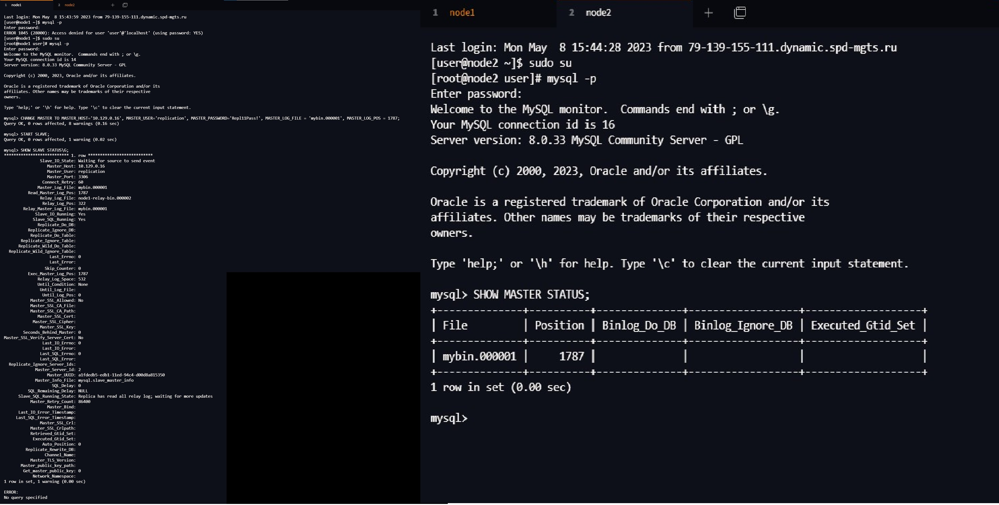
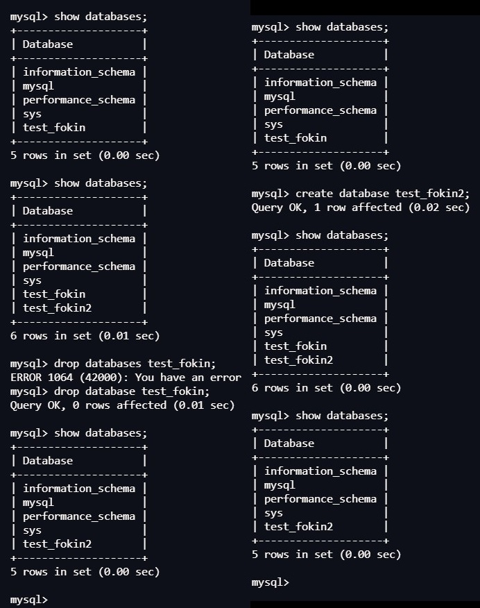

# Домашнее задание к занятию «Репликация и масштабирование. Часть 1» - Алексей Фокин

---

### Задание 1

На лекции рассматривались режимы репликации master-slave, master-master, опишите их различия.

*Ответить в свободной форме.*

#### Репликация master-slave

Master — это основной сервер БД, куда поступают все данные. Все
изменения в данных (добавление, обновление, удаление) должны
происходить на этом сервере.
Slave — это вспомогательный сервер БД, который копирует все
данные с мастера. С этого сервера следует читать данные. Таких
серверов может быть несколько.
Используется для повышения отказоустойчивости, для распределения нагрузки. Может быть использована для резервного копирования. 

#### Репликация master-master

Репликация master-master позволяет копировать данные с
одного сервера на другой. Эта конфигурация добавляет
избыточность и повышает эффективность при обращении к
данным.
Master-Master репликации – это настройка обычной Master-Slave
репликации, только в обе стороны (каждый сервер является
мастером и слейвом одновременно).

---

### Задание 2

Выполните конфигурацию master-slave репликации, примером можно пользоваться из лекции.

*Приложите скриншоты конфигурации, выполнения работы: состояния и режимы работы серверов.*

---
### Задание 3* 

Выполните конфигурацию master-master репликации. Произведите проверку.

*Приложите скриншоты конфигурации, выполнения работы: состояния и режимы работы серверов.*

