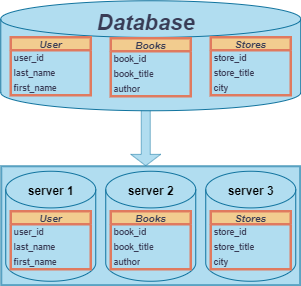

# Домашнее задание к занятию «Репликация и масштабирование. Часть 2» - Алексей Фокин

---
### Задание 1

Опишите основные преимущества использования масштабирования методами:

- активный master-сервер и пассивный репликационный slave-сервер;

1. Высокая скорость выполнения запросов на чтение, за счет распределения данных между серверами.
2. Высокая доступность, надежность и отказоустойчивость, так как есть возможность создать резервные копии данных на slave-серверах.
3. Если master-сервер по какой-то причине отказался работать, то можно переключиться на slave-сервер и сделать его мастером.

- master-сервер и несколько slave-серверов;

1. Отказоустойчивость - в случае сбоя на одном сервере, остальные серверы продолжат работу.
2. Высокая доступность и распределение нагрузки.
3. Чем больше slave-серверов, тем быстрее выполняется чтение данных.

- активный сервер со специальным механизмом репликации — distributed replicated block device (DRBD);

1. Репликация данных происходит в режиме реального времени, что позволяет минимизировать время простоя в случае сбоя на одном из серверов.
2. Высокая доступность, отказоустойчивость.
3. В случаи отказа дисковой подсистемы сервис продолжит работу с расположенной в сети репликой данных.

- SAN-кластер.

1. Высокая производительность и отказоустойчивость благодаря общему доступу к устройствам хранения данных.
2. Возможность горячей замены отказавших компонентов.
3. Возможность перемонтировать на другой сервер

*Дайте ответ в свободной форме.*

---

### Задание 2

Разработайте план для выполнения горизонтального и вертикального шаринга базы данных. База данных состоит из трёх таблиц: 

- пользователи, 
- книги, 
- магазины (столбцы произвольно). 

Опишите принципы построения системы и их разграничение или разбивку между базами данных.

*Пришлите блоксхему, где и что будет располагаться. Опишите, в каких режимах будут работать сервера.* 

## Дополнительные задания (со звёздочкой*)
Эти задания дополнительные, то есть не обязательные к выполнению, и никак не повлияют на получение вами зачёта по этому домашнему заданию. Вы можете их выполнить, если хотите глубже шире разобраться в материале.

---
### Задание 3*

Выполните настройку выбранных методов шардинга из задания 2.

*Пришлите конфиг Docker и SQL скрипт с командами для базы данных*.
