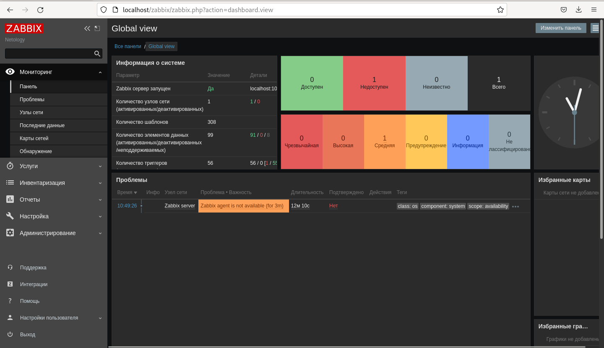

Домашнее задание к занятию 9.1. «Обзор систем IT-мониторинга» - Фокин Алексей

Задание 1

Эти задания дополнительные (не обязательные к выполнению) и никак не повлияют на получение вами зачета по этому домашнему заданию. Вы можете их выполнить, если хотите глубже и/или шире разобраться в материале.
Задание 2

 

